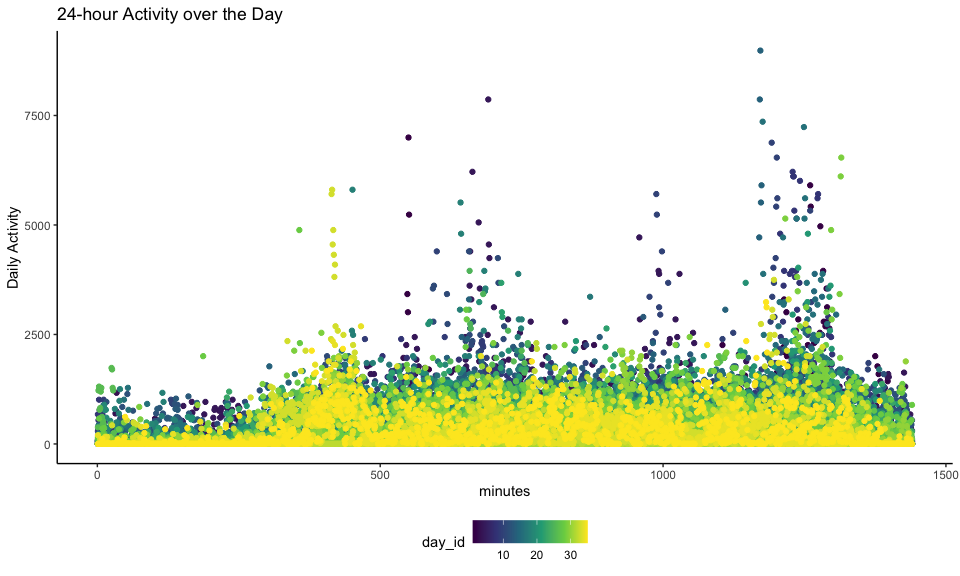

p8105\_hw3\_fc2691
================
FC
10/16/2021

``` r
library(tidyverse)
```

    ## ── Attaching packages ─────────────────────────────────────── tidyverse 1.3.1 ──

    ## ✓ ggplot2 3.3.5     ✓ purrr   0.3.4
    ## ✓ tibble  3.1.4     ✓ dplyr   1.0.7
    ## ✓ tidyr   1.1.3     ✓ stringr 1.4.0
    ## ✓ readr   2.0.1     ✓ forcats 0.5.1

    ## ── Conflicts ────────────────────────────────────────── tidyverse_conflicts() ──
    ## x dplyr::filter() masks stats::filter()
    ## x dplyr::lag()    masks stats::lag()

``` r
library(p8105.datasets)
library(knitr)

knitr::opts_chunk$set(
  fig.width = 10,
  fig.asp = .6,
  out.width = "90%"
)

theme_set(theme_minimal() + theme(legend.position = "bottom"))

options(
  ggplot2.continuous.colour = "viridis",
  ggplot2.continuous.fill = "viridis"
)

scale_colour_discrete = scale_colour_viridis_d
scale_fill_discrete = scale_fill_viridis_d
```

### Problem 1

The goal is to do some exploration of this dataset. To that end, write a
short description of the dataset, noting the size and structure of the
data, describing some key variables, and giving illstrative examples of
observations. Then, do or answer the following (commenting on the
results of each):

``` r
data("instacart") #load a dataset
library(ggplot2)
# Find out the most ordered aisle. 
insta_aisle = 
  instacart %>% 
  janitor::clean_names() %>% 
  distinct() %>% 
  group_by(aisle, aisle_id, department) %>% 
  summarise(aisles_obs = n()) %>% 
  arrange(desc(aisles_obs))
```

    ## `summarise()` has grouped output by 'aisle', 'aisle_id'. You can override using the `.groups` argument.

``` r
kable(insta_aisle[1:5,], caption = "Instacart Aisles Count")
```

| aisle                      | aisle\_id | department | aisles\_obs |
|:---------------------------|----------:|:-----------|------------:|
| fresh vegetables           |        83 | produce    |      150609 |
| fresh fruits               |        24 | produce    |      150473 |
| packaged vegetables fruits |       123 | produce    |       78493 |
| yogurt                     |       120 | dairy eggs |       55240 |
| packaged cheese            |        21 | dairy eggs |       41699 |

Instacart Aisles Count

``` r
# Make a plot shows the number of orders in each aisle. 
plot_insta_aisle = 
  insta_aisle %>% 
  filter(aisles_obs > 10000) %>% 
  ggplot(aes(x = aisle_id, y = aisles_obs, color = department)) + 
    geom_point() + geom_line() + 
    theme_classic() +
    theme(legend.position = "bottom") + 
    labs(
    title = "Order Number in Aisles (>10000)",
    x = "Aisle ID (#)",
    y = "Order Numbers (N)",
    caption = "Data from the instacart package"
  )
plot_insta_aisle
```


``` r
####
#Make a plot shows the number of order items in produce
plot_insta_prod = 
  insta_aisle %>% 
  filter(department == 'produce' & aisles_obs > 10000) %>% 
  ggplot(aes(x = aisle, y = aisles_obs)) +
    geom_bar(stat = "identity", alpha = 0.5) +
    theme_classic() +
    theme(legend.position = "bottom") +
    labs(
    title = "Order Number in produce (>10000)",
    x = "Aisle",
    y = "Order Numbers (N)",
    caption = "Data from the instacart package"
  )
plot_insta_prod
```


-   How many aisles are there, and which aisles are the most items
    ordered from?  
    **ANSWER**: There are 134 aisles in this instacart data. Fresh
    vegetables are the most ordered items from which reached about
    150609 orders.  
-   Make a plot that shows the number of items ordered in each aisle,
    limiting this to aisles with more than 10000 items ordered. Arrange
    aisles sensibly, and organize your plot so others can read it.  
-   Make a table showing the three most popular items in each of the
    aisles “baking ingredients”, “dog food care”, and “packaged
    vegetables fruits”. Include the number of times each item is ordered
    in your table.

``` r
# Show the three most popular items in three aisles. 
pop_items = 
  instacart %>% 
  janitor::clean_names() %>% 
  filter(aisle == 'baking ingredients' | aisle == 'dog food care' | aisle == 'packaged vegetables fruits') %>% 
  distinct() %>% 
  group_by(aisle, product_name) %>% 
  summarise(pop_items_obs = n()) %>% 
  arrange(aisle, desc(pop_items_obs)) %>% 
  slice(1:3)
```

    ## `summarise()` has grouped output by 'aisle'. You can override using the `.groups` argument.

``` r
kable(pop_items, caption = "Three Most Popular Items in Aisles" )
```

| aisle                      | product\_name                                 | pop\_items\_obs |
|:---------------------------|:----------------------------------------------|----------------:|
| baking ingredients         | Light Brown Sugar                             |             499 |
| baking ingredients         | Pure Baking Soda                              |             387 |
| baking ingredients         | Cane Sugar                                    |             336 |
| dog food care              | Snack Sticks Chicken & Rice Recipe Dog Treats |              30 |
| dog food care              | Organix Chicken & Brown Rice Recipe           |              28 |
| dog food care              | Small Dog Biscuits                            |              26 |
| packaged vegetables fruits | Organic Baby Spinach                          |            9784 |
| packaged vegetables fruits | Organic Raspberries                           |            5546 |
| packaged vegetables fruits | Organic Blueberries                           |            4966 |

Three Most Popular Items in Aisles

-   Make a table showing the mean hour of the day at which Pink Lady
    Apples and Coffee Ice Cream are ordered on each day of the week;
    format this table for human readers (i.e. produce a 2 x 7 table).

``` r
# The mean hour of the day for lady apples and coffee ice cream
mean_hrs_sum = 
  instacart %>% 
  janitor::clean_names() %>% 
  filter(product_name == 'Pink Lady Apples' | product_name == 'Coffee Ice Cream') %>% 
  distinct() %>% 
  group_by(product_name, order_dow) %>%  
  summarize(mean_hrs = mean(order_hour_of_day)) %>% 
  mutate(mean_hrs = 
           round(as.numeric(mean_hrs), 1)) %>% 
  mutate(order_dow = recode(    
    order_dow,
    "0" = "Sun",
    "1" = "Mon",
    "2" = "Tue",
    "3" = "Wed",
    "4" = "Thu",
    "5" = "Fri",
    "6" = "Sat")) %>% 
  pivot_wider(
    names_from = "order_dow",
    values_from = "mean_hrs"
  ) 
```

    ## `summarise()` has grouped output by 'product_name'. You can override using the `.groups` argument.

``` r
kable(mean_hrs_sum, caption = "The Mean Hour of the Day for P&C")
```

| product\_name    |  Sun |  Mon |  Tue |  Wed |  Thu |  Fri |  Sat |
|:-----------------|-----:|-----:|-----:|-----:|-----:|-----:|-----:|
| Coffee Ice Cream | 13.8 | 14.3 | 15.4 | 15.3 | 15.2 | 12.3 | 13.8 |
| Pink Lady Apples | 13.4 | 11.4 | 11.7 | 14.2 | 11.6 | 12.8 | 11.9 |

The Mean Hour of the Day for P&C

*To that end, write a short description of the dataset, noting the size
and structure of the data, describing some key variables, and giving
illstrative examples of observations. Then, do or answer the following
(commenting on the results of each):*  
**ANSWER**: From the dataset gained from Instacart, it’s dimension is
(1384617, 15) which describes the order details from customers including
information about products, order time, frequency, department and so on.
It shows the most popular aisle type is fresh vegetables from the
produce department (fresh fruits, fresh vegetables, packaged vegetables
fruit…) which we eat often everyday. The three most popular items in
“baking ingredients” aisle are light brown sugar, pure baking soda and
cane sugar. The three most popular items in “dog food care” aisle are
snack sticks chicken & rice recipe dog treat, organix chicken & brown
rice recipe and small dog biscuits. The most three popular items in
“packaged vegetable fruits” aisle are organic baby spinach, organic
raspberries and organic blueberries. The mean hour of ice cream is
relatively late compared to people who buy pink lady apples. And mean
hour of Wed is relatively later than other days of the week for pink
lady, and the mean hour for customers who buy ice cream is later on Tue
to Thu.

### Problem 2

This problem uses the BRFSS (dataset\_brfss.html) data. DO NOT include
this dataset in your local data directory; instead, load the data from
the p8105.datasets (<https://github.com/P8105/p8105.datasets>)
package.  
First, do some data cleaning:  
- format the data to use appropriate variable names;  
- focus on the “Overall Health” topic  
- include only responses from “Excellent” to “Poor”  
- organize responses as a factor taking levels ordered from “Poor” to
“Excellent”

``` r
data("brfss_smart2010")

#Clean brfss data and focus on the response from "Overall Health" topic. 
brfss_clean = 
  brfss_smart2010 %>% 
  janitor::clean_names() %>% 
  distinct() %>% 
  filter(topic == "Overall Health") %>% 
  separate(locationdesc, into = c("state", "county"), sep = " - ") %>%
  select(year, state, county, response, data_value) %>%
  mutate(
    response = factor(response, levels = c("Poor", "Fair", "Good", "Very good", "Excellent"), order = T))
kable(brfss_clean[1:10,], caption = "BRFSS Data on 'Overall Health' Topic")
```

| year | state | county           | response  | data\_value |
|-----:|:------|:-----------------|:----------|------------:|
| 2010 | AL    | Jefferson County | Excellent |        18.9 |
| 2010 | AL    | Jefferson County | Very good |        30.0 |
| 2010 | AL    | Jefferson County | Good      |        33.1 |
| 2010 | AL    | Jefferson County | Fair      |        12.5 |
| 2010 | AL    | Jefferson County | Poor      |         5.5 |
| 2010 | AL    | Mobile County    | Excellent |        15.6 |
| 2010 | AL    | Mobile County    | Very good |        31.3 |
| 2010 | AL    | Mobile County    | Good      |        31.2 |
| 2010 | AL    | Mobile County    | Fair      |        15.5 |
| 2010 | AL    | Mobile County    | Poor      |         6.4 |

BRFSS Data on ‘Overall Health’ Topic

Using this dataset, do or answer the following (commenting on the
results of each):  
- In 2002, which states were observed at 7 or more locations? What about
in 2010?

``` r
# Summarize location according to states in 2002 and 2010. 
brfss_obs_02_10 = 
  brfss_clean %>% 
  filter(year == 2002 | year == 2010) %>% 
  group_by(year, state) %>% 
  summarize(location_count = n()) %>% 
  filter(location_count >= 7) %>% 
  pivot_wider(
    names_from = state, 
    values_from = location_count
  )
```

    ## `summarise()` has grouped output by 'year'. You can override using the `.groups` argument.

``` r
kable(brfss_obs_02_10, caption = "States observed >=7 locations in 2002 and 2010")
```

| year |  AZ |  CO |  CT |  DE |  FL |  GA |  HI |  ID |  IL |  IN |  KS |  LA |  MA |  MD |  ME |  MI |  MN |  MO |  NC |  NE |  NH |  NJ |  NV |  NY |  OH |  OK |  OR |  PA |  RI |  SC |  SD |  TN |  TX |  UT |  VT |  WA |  AL |  AR |  CA |  IA |  MS |  MT |  ND |  NM |  WY |
|-----:|----:|----:|----:|----:|----:|----:|----:|----:|----:|----:|----:|----:|----:|----:|----:|----:|----:|----:|----:|----:|----:|----:|----:|----:|----:|----:|----:|----:|----:|----:|----:|----:|----:|----:|----:|----:|----:|----:|----:|----:|----:|----:|----:|----:|----:|
| 2002 |  10 |  20 |  35 |  15 |  35 |  15 |  20 |  10 |  15 |  10 |  15 |  15 |  40 |  30 |  10 |  20 |  20 |  10 |  35 |  15 |  25 |  40 |  10 |  25 |  20 |  15 |  15 |  50 |  20 |  15 |  10 |  10 |  10 |  25 |  15 |  20 |  NA |  NA |  NA |  NA |  NA |  NA |  NA |  NA |  NA |
| 2010 |  15 |  35 |  25 |  15 | 205 |  20 |  20 |  30 |  10 |  15 |  20 |  25 |  45 |  60 |  30 |  20 |  25 |  15 |  60 |  50 |  25 |  95 |  10 |  45 |  40 |  15 |  20 |  35 |  25 |  35 |  10 |  25 |  80 |  30 |  30 |  50 |  15 |  15 |  60 |  10 |  10 |  15 |  15 |  30 |  10 |

States observed &gt;=7 locations in 2002 and 2010

*ANSWER*: In 2002, AZ, CO, CT, DE, FL, GA, HI, ID, IL, IN, KS, LA, MA,
MD, ME, MI, MN, MO, NC, NE, NH, NJ, NV, NY, OH, OK, OR, PA, RI, SC, SD,
TN, TX, UT, VT, WA observed 7 or more locations. In 2010, besides the
states observed on 2002, AL, AR, CA, IA, MS, MT, ND, NM, WY also
observed 7 or more locations.  
- Construct a dataset that is limited to Excellent responses, and
contains, year, state, and a variable that averages the data\_value
across locations within a state. Make a “spaghetti” plot of this average
value over time within a state (that is, make a plot showing a line for
each state across years – the geom\_line geometry and group aesthetic
will help).

``` r
# Clean brfss response table which is limited to excellent response with the average of data_value. 
brfss_response = 
  brfss_clean %>% 
  filter(response == "Excellent") %>% #limit to excellent response
  group_by(year, state) %>%
  summarise(avg_data_value = mean(data_value)) %>% 
  mutate(avg_data_value = round(as.numeric(avg_data_value), 1))
```

    ## `summarise()` has grouped output by 'year'. You can override using the `.groups` argument.

``` r
# Show readable table for the dataset. 
brfss_response_table = 
  brfss_response %>% 
  pivot_wider(
    names_from = year, 
    values_from = avg_data_value
  )
kable(brfss_response_table[1:10,], caption = "Average Data Value within States with Excellent Response")
```

| state | 2002 | 2003 | 2004 | 2005 | 2006 | 2007 | 2008 | 2009 | 2010 |
|:------|-----:|-----:|-----:|-----:|-----:|-----:|-----:|-----:|-----:|
| AK    | 27.9 | 24.9 | 23.0 | 23.9 |   NA | 23.5 | 20.6 | 23.2 |   NA |
| AL    | 18.5 | 19.5 | 20.0 | 16.2 | 23.2 | 18.6 | 15.9 | 21.6 | 18.4 |
| AR    | 24.1 | 24.3 | 21.0 | 23.1 | 19.6 | 18.8 | 19.7 | 23.3 | 25.4 |
| AZ    | 24.1 | 26.3 | 22.3 | 22.8 | 20.9 | 19.1 | 18.9 | 22.0 | 21.6 |
| CA    | 22.7 | 22.0 | 18.1 | 23.5 | 21.2 | 24.5 | 22.9 | 24.1 | 23.9 |
| CO    | 23.1 | 23.3 | 23.4 | 25.3 | 23.1 | 25.3 | 24.5 | 24.6 | 25.4 |
| CT    | 29.1 | 29.2 | 26.3 | 24.2 | 25.9 | 25.1 | 26.0 | 25.6 | 24.2 |
| DC    | 29.3 | 27.3 | 28.8 | 26.4 | 27.9 | 26.6 | 26.5 | 28.0 | 26.1 |
| DE    | 20.9 | 21.5 | 19.4 | 20.3 | 20.4 | 19.1 | 18.4 | 19.3 | 20.3 |
| FL    | 25.7 |   NA | 21.7 | 25.3 | 25.5 | 21.4 | 27.4 | 22.6 |   NA |

Average Data Value within States with Excellent Response

``` r
# Making "spaghetti"plot
brfss_response_plot = 
  brfss_response %>% 
  ggplot(aes(x = year, y = avg_data_value, color = state)) + 
    geom_line(alpha = 0.5) + 
    theme_classic() + 
    theme(legend.position = "bottom") + 
    labs(
     title = "Average Value Over Time within States", 
     x = "Year(2002~2010)", 
     y = "Value Average", 
     caption = "Data from brfss package"
  ) 
brfss_response_plot
```

    ## Warning: Removed 3 row(s) containing missing values (geom_path).


-   Make a two-panel plot showing, for the years 2006, and 2010,
    distribution of data\_value for responses (“Poor” to “Excellent”)
    among locations in NY State.

``` r
library(patchwork)
#Distribution in NY in 2006
brfss_data_2006 = 
  brfss_clean %>% 
  filter(year == 2006 & state == "NY") %>% 
  ggplot(aes(x = response, y = data_value)) +
    geom_violin(fill = "grey", color = "grey") +
    theme_classic() +
    theme(legend.position = "bottom")
  #   labs(
  #    title = "Value for Responses in NY 2006",
  #    x = "Response",
  #    y = "Value",
  #    caption = "Data from brfss package"
  # )
#Distribution in NY in 2010
brfss_data_2010 = 
  brfss_clean %>% 
  filter(year == 2010 & state == "NY") %>% 
  ggplot(aes(x = response, y = data_value)) +
    geom_violin(fill = "grey", color = "grey") +
    theme_classic() +
    theme(legend.position = "bottom") 
    
#Make two-panel plot
brfss_data_2006 + brfss_data_2010 + 
  labs(
     title = "Value for Responses in NY 2010",
     x = "Response",
     y = "Value",
     caption = "Data from brfss package"
  )
```


### Problem 3

Accelerometers have become an appealing alternative to self-report
techniques for studying physical activity in observational studies and
clinical trials, largely because of their relative objectivity. During
observation periods, the devices measure “activity counts” in a short
period; one-minute intervals are common. Because accelerometers can be
worn comfortably and unobtrusively, they produce around-the-clock
observations.  
This problem uses five weeks of accelerometer data collected on a 63
year-old male with BMI 25, who was admitted to the Advanced Cardiac Care
Center of Columbia University Medical Center and diagnosed with
congestive heart failure (CHF). The data can be downloaded here
(./data/accel\_data.csv). In this spreadsheet, variables activity.\* are
the activity counts for each minute of a 24-hour day starting at
midnight.

-   Load, tidy, and otherwise wrangle the data. Your final dataset
    should include all originally observed variables and values; have
    useful variable names; include a weekday vs weekend variable; and
    encode data with reasonable variable classes. Describe the resulting
    dataset (e.g. what variables exist, how many observations, etc).

``` r
#Tidy and wrangle accelerarometer data.
read_accel = read_csv("./accel_data.csv")
```

    ## Rows: 35 Columns: 1443

    ## ── Column specification ────────────────────────────────────────────────────────
    ## Delimiter: ","
    ## chr    (1): day
    ## dbl (1442): week, day_id, activity.1, activity.2, activity.3, activity.4, ac...

    ## 
    ## ℹ Use `spec()` to retrieve the full column specification for this data.
    ## ℹ Specify the column types or set `show_col_types = FALSE` to quiet this message.

``` r
accel_clean =
  read_accel %>%
  janitor::clean_names() %>% 
  distinct() %>% 
  pivot_longer(
    activity_1:activity_1440, 
    names_to = "mins", 
    values_to = "act_count"
  ) %>% 
  mutate(
    week = 
      case_when(
        day == "Monday" ~ "weekday", 
        day == "Tuesday" ~ "weekday", 
        day == "Wednesday" ~ "weekday", 
        day == "Thursday" ~ "weekday",
        day == "Friday" ~ "weekday", 
        day == "Saturday" ~ "weekend", 
        day == "Sunday" ~ "weekend")
  ) %>% 
  select(day_id, day, week, mins, act_count) %>% 
  mutate(
    act_level = 
      ifelse(act_count < 0, "Error", 
             ifelse(act_count <= 100, "Sedentary", 
                    ifelse(act_count <= 800, "Low Intensity", 
                           ifelse(act_count <= 2000, "Light Intensity", 
                                  ifelse(act_count <= 4000, "Moderate Intensity", "Vigorous Intensity"))))))
#mutate(weekday_or_not = !(day %in% c("Saturday","Sunday"))) %>% 
#weekday_or_not = ifelse(weekday_or_not == T, 'weekday','weekend')
kable(accel_clean[1:20,], caption = "Accelerometer Observation Data in 35 days")
```

| day\_id | day    | week    | mins         | act\_count | act\_level |
|--------:|:-------|:--------|:-------------|-----------:|:-----------|
|       1 | Friday | weekday | activity\_1  |   88.37778 | Sedentary  |
|       1 | Friday | weekday | activity\_2  |   82.24444 | Sedentary  |
|       1 | Friday | weekday | activity\_3  |   64.44444 | Sedentary  |
|       1 | Friday | weekday | activity\_4  |   70.04444 | Sedentary  |
|       1 | Friday | weekday | activity\_5  |   75.04444 | Sedentary  |
|       1 | Friday | weekday | activity\_6  |   66.26667 | Sedentary  |
|       1 | Friday | weekday | activity\_7  |   53.75556 | Sedentary  |
|       1 | Friday | weekday | activity\_8  |   47.84444 | Sedentary  |
|       1 | Friday | weekday | activity\_9  |   55.46667 | Sedentary  |
|       1 | Friday | weekday | activity\_10 |   42.95556 | Sedentary  |
|       1 | Friday | weekday | activity\_11 |   46.75556 | Sedentary  |
|       1 | Friday | weekday | activity\_12 |   25.48889 | Sedentary  |
|       1 | Friday | weekday | activity\_13 |   18.97778 | Sedentary  |
|       1 | Friday | weekday | activity\_14 |   31.11111 | Sedentary  |
|       1 | Friday | weekday | activity\_15 |   22.86667 | Sedentary  |
|       1 | Friday | weekday | activity\_16 |   24.80000 | Sedentary  |
|       1 | Friday | weekday | activity\_17 |   51.02222 | Sedentary  |
|       1 | Friday | weekday | activity\_18 |   35.48889 | Sedentary  |
|       1 | Friday | weekday | activity\_19 |   40.97778 | Sedentary  |
|       1 | Friday | weekday | activity\_20 |   59.02222 | Sedentary  |

Accelerometer Observation Data in 35 days

    **Description:**  
    My tidy dataset's dimension is (50400, 6) and it includes 5 variables, including day_id, day, week, act_mins and act_count. It shows from the table that it includes total 50,400 observations. 

    - Traditional analyses of accelerometer data focus on the total activity over the day. Using your tidied dataset, aggregate accross minutes to create a total activity variable for each day, and create a table showing these totals. Are any trends apparent?

    ```r
    # Calculate the accelerometer data on the total activity over the day. 
    accel_act_total = 
      accel_clean %>% 
      group_by(day_id) %>% 
      summarise(act_total = sum(act_count)) %>% 
      mutate(act_total = round(as.numeric(act_total), 2))
    kable(accel_act_total[1:10,], caption = "Total Activity of Accelerometer over the Day")

| day\_id | act\_total |
|--------:|-----------:|
|       1 |  480542.62 |
|       2 |   78828.07 |
|       3 |  376254.00 |
|       4 |  631105.00 |
|       5 |  355923.64 |
|       6 |  307094.24 |
|       7 |  340115.01 |
|       8 |  568839.00 |
|       9 |  295431.00 |
|      10 |  607175.00 |

Total Activity of Accelerometer over the Day

``` r
#Make a plot to see trends
accel_total_plot = 
  accel_act_total %>% 
  ggplot(aes(x = day_id, y = act_total)) + 
  geom_line() + 
  theme_classic() +
  theme(legend.position = "bottom") + 
  labs(
     title = "Trend of Total Activity of Accelerometer",
     x = "Day (0~35)",
     y = "Total Activity"
  )
accel_total_plot
```


**ANSWER** It seems like there is no apparent trends for the relation
between total activity and day.

-   Accelerometer data allows the inspection activity over the course of
    the day. Make a single- panel plot that shows the 24-hour activity
    time courses for each day and use color to indicate day of the week.
    Describe in words any patterns or conclusions you can make based on
    this graph.

``` r
# wrangle accelrometer data. 
accel_act_day = 
  accel_clean %>% 
  mutate(act_count = round(as.numeric(act_count),2)) %>% 
  separate(mins, into = c("act", "mins"), sep = "_") %>% 
  mutate(mins = as.numeric(mins))
# make a plot
accel_act_day_plot = 
  accel_act_day %>%
  ggplot(aes(x = mins, y = act_count, color = day_id)) + 
  geom_line() +
  theme_classic() +
  theme(legend.position = "bottom") + 
  labs(
     title = "24-hour Activity over the Day",
     x = "minutes",
     y = "Daily Activity"
  )
accel_act_day_plot 
```


**ANSWER** From the plot, the activity is more active during the
day(morning and afternoon), and the activity count would significantly
decrease during the night. test test test
